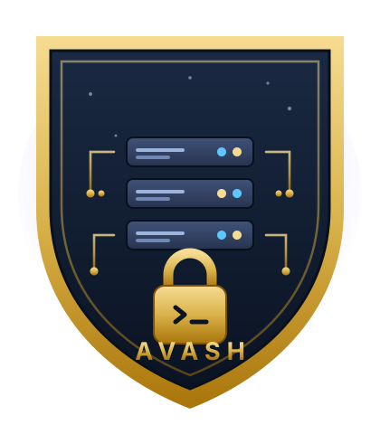
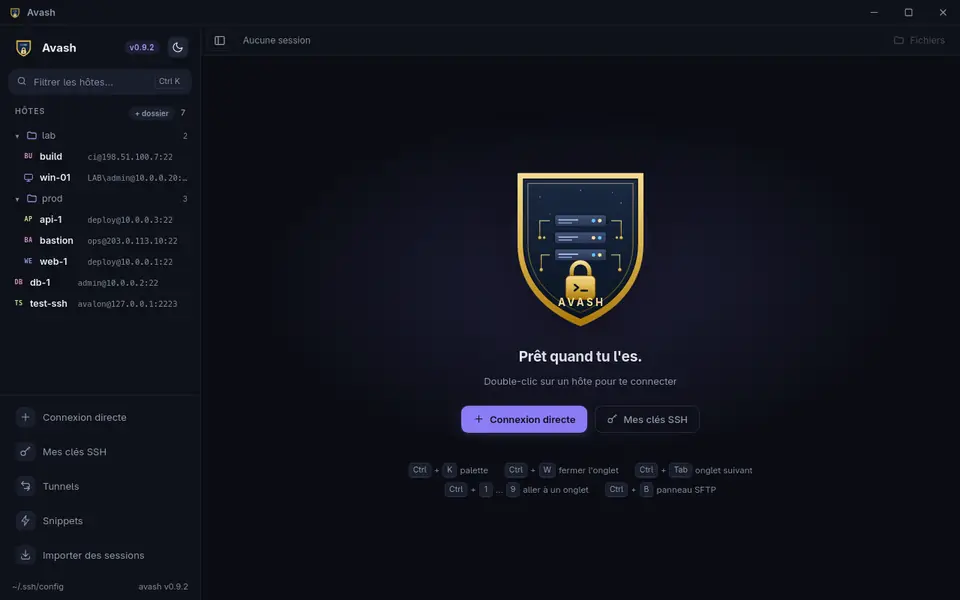
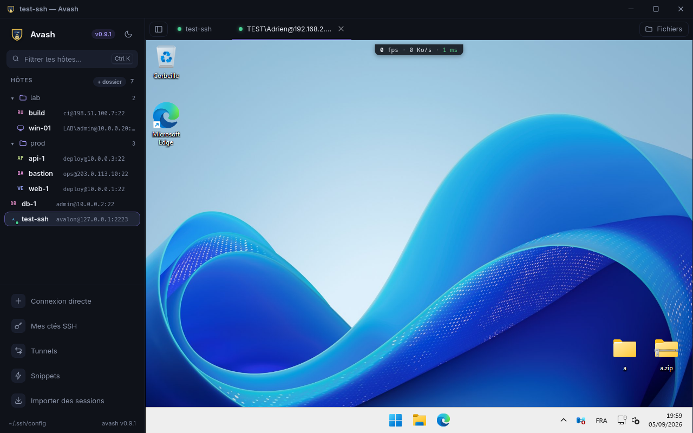
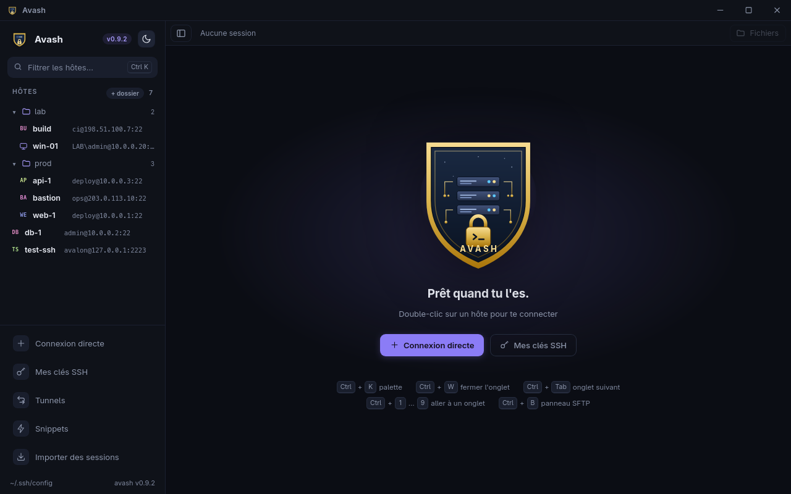
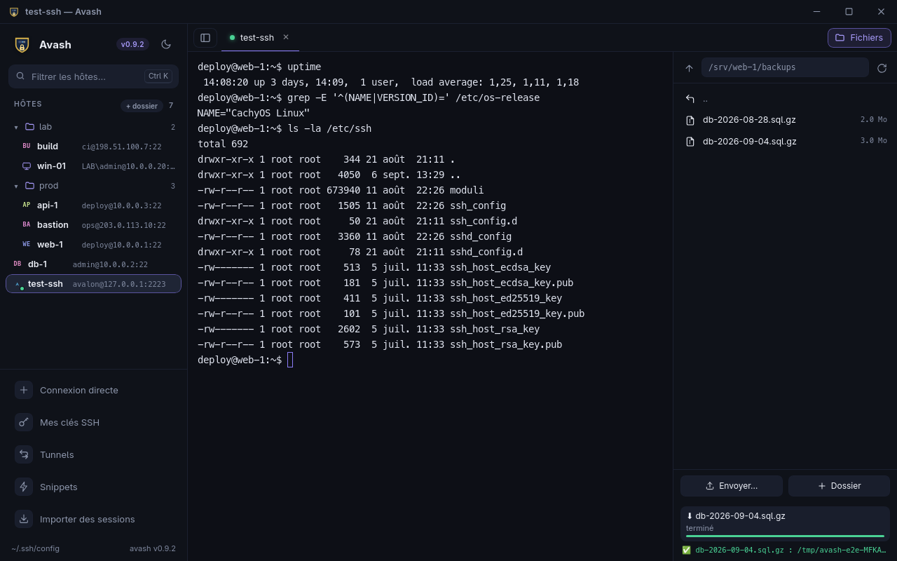
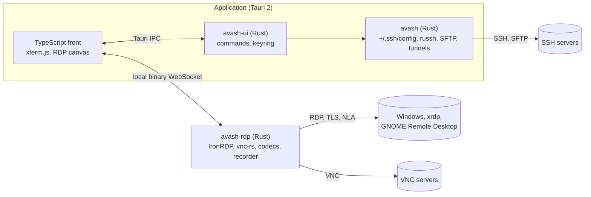

<div align="center">



# avash

**A native, fast and secure SSH, RDP and VNC connection manager.**

Your SSH terminals, your remote desktops and your file transfers in a single
application, which reads your `~/.ssh/config` as it is.

[Website](https://adrienavalon.github.io/avash/en/) · [Français](README.md) · [English](README.en.md)

[](https://github.com/AdrienAvalon/avash/releases/latest)
[](https://github.com/AdrienAvalon/avash/releases)
[](#install)
[](LICENSE)

[](https://github.com/AdrienAvalon/avash/actions/workflows/ci.yml)
[](https://github.com/AdrienAvalon/avash/actions/workflows/securite.yml)
[](https://scorecard.dev/viewer/?uri=github.com/AdrienAvalon/avash)
[](docs/qualite.md)



</div>

> The project's language is French: documentation, commit messages and the
> interface strings live in French first. The interface itself is available in
> French and English, and issues are welcome in either language.

## At a glance

| | |
|---|---|
| **SSH** | full terminal (xterm.js), tabs, chained `ProxyJump`, agent, keys generated and deployed from the app |
| **RDP** | Windows, xrdp and GNOME Remote Desktop desktops built in (IronRDP), native resizing with no image scaling, clipboard shared on request, files copied and pasted both ways |
| **VNC** | VNC desktops in the same window (ZRLE, keyboard as keysyms, clipboard), through the same process as RDP |
| **SFTP** | a file panel on the terminal's own session: browse, upload and download files or whole folders, resume an interrupted transfer, a transfer queue with speeds, host-to-host copy without touching the local disk |
| **Serial** | the console of a switch, a router or a board in a terminal tab, ports detected on the machine, speed of your choice |
| **Tunnels** | local (`-L`), remote (`-R`) and SOCKS (`-D`), with live status |
| **Organisation** | drag-and-drop folders, tags, instant search, command palette, snippets, host health, session recording |
| **Import** | PuTTY (files or registry) and MobaXterm, RDP desktops and folders included |
| **Security** | passwords in the system keyring, host keys checked for SSH **and** RDP before any credential leaves, no telemetry |

<div align="center">

</div>

## Why avash

- **Nothing to migrate.** avash reads `~/.ssh/config` and writes what you add
  in OpenSSH's own format: your hosts show up on first launch, and `ssh` on the
  command line keeps seeing the same thing.
- **Native.** Tauri 2 and Rust, no Electron: about twenty megabytes, a start-up
  in a fraction of a second, a remote desktop that follows the window pixel for
  pixel.
- **Safe by default.** A server whose key changed is refused, for SSH as for
  RDP, and an RDP server cannot obtain a password without mutual
  authentication. Secrets live in the keyring, never in a file.
- **Free software.** AGPL-3.0, auditable code, binaries with a provenance
  attestation and a software bill of materials (SBOM).

<div align="center">

</div>

## Install

Binaries are on the [releases page](https://github.com/AdrienAvalon/avash/releases/latest),
signed for the automatic updater and shipped with their checksums.

### Linux

```bash
chmod +x Avash_0.8.0_amd64.AppImage
./Avash_0.8.0_amd64.AppImage
```

The AppImage bundles everything, WebKitGTK included: nothing to install.
For a package-manager install, each release also carries a `.deb` (Debian,
Ubuntu) and an `.rpm` (Fedora, openSUSE):

```bash
sudo apt install ./Avash_0.8.0_amd64.deb      # Debian, Ubuntu
sudo dnf install ./Avash-0.8.0-1.x86_64.rpm    # Fedora
```

Arch Linux: `packaging/aur/avash/PKGBUILD` builds the package from source
(`makepkg -si`).

### Windows

- **Installer** `Avash_x.y.z_x64-setup.exe`, a regular installation.
- **Portable** `avash-x.y.z-windows-x64.zip`: unzip and run, no installation
  and nothing written to the registry. Keep `avash-rdp.exe` next to
  `avash.exe`.

Windows shows a warning on first launch: avash is not signed with an
Authenticode certificate. "More info", then "Run anyway".

### macOS

`Avash_x.y.z_aarch64.dmg` for Apple silicon Macs. The app is not notarised:
right-click the application, **Open**, once. The macOS build is built and
tested in CI but has not been tried on a real machine yet: feedback welcome.

### Verify what you downloaded

```bash
sha256sum -c SHA256SUMS                                             # integrity
gh attestation verify Avash_0.8.0_amd64.AppImage --repo AdrienAvalon/avash   # provenance
```

The second check proves the file comes from this repository, at this commit,
built by our CI (Sigstore attestation).

### From source

Stable Rust, Node.js 22 and Tauri's system dependencies are enough; the steps
are in [CONTRIBUTING.md](CONTRIBUTING.md) (in French). `./scripts/release.sh`
runs validation, build and checksums in one go.

### First launch, in three moves

1. Your hosts from `~/.ssh/config` are already in the sidebar; **double-click**
   to open a terminal, `Ctrl+B` for the file panel.
2. **Direct connection** for an SSH server or an RDP desktop that is not there
   yet; tick "save" and it stays, in OpenSSH's own format.
3. `Ctrl+K` for everything else: hosts, tunnels, snippets, language, host
   health, recordings. The password, once: it goes to the keyring.

## Day to day

<div align="center">

</div>

| Shortcut | Action |
|---|---|
| `Ctrl+K` | Command palette: hosts, actions, language, health, recordings |
| `Ctrl+W` · `Ctrl+Tab` · `Ctrl+1`…`9` | Close, next, go to a tab |
| `Ctrl+B` | File panel (SFTP) |
| `Ctrl+Shift+E` | Split view: two tabs side by side |
| `↑` `↓` `Enter` `Shift+F10` | The whole sidebar from the keyboard |

<div align="center">

</div>

- Interface in **French** and **English**: follows the locale, switchable from
  the palette, or `AVASH_LANGUE=fr|en`.
- **Host health**: one TCP probe per host, on demand or at start-up, a light on
  each row.
- **Session recording** in asciicast v2, replayable with `asciinema play`; the
  output, never the keystrokes.
- **Accessible**: full keyboard navigation, contrasts checked by `axe-core` on
  both themes.
- **Last time's tabs**: on launch, the home screen offers to reopen what was
  open; offered, never imposed.
- **A diagnostic to attach to an issue**: "Export a diagnostic…" in the palette
  writes versions, system, configuration as counts and remote desktop logs;
  never a password nor a host name.

## Compared with other tools

| | avash | PuTTY | MobaXterm | Remmina | Termius |
|---|:-:|:-:|:-:|:-:|:-:|
| SSH, RDP, VNC and SFTP in one window | ✓ | SSH | ✓ | ✓ | SSH, SFTP |
| Reads and writes `~/.ssh/config` | ✓ | – | – | – | import |
| Linux, Windows, macOS | ✓ | Windows, Unix | Windows | Linux | ✓ |
| Native, no Electron | ✓ | ✓ | ✓ | ✓ | – |
| RDP host key checked before credentials | ✓ | – | – | ✓ | – |
| Passwords in the system keyring | ✓ | – | encrypted | ✓ | cloud |
| Free software | AGPL-3.0 | MIT | freemium | GPL-2.0 | subscription |

From each tool's public documentation, September 2026. Open an issue if a cell
is wrong.

## Security

- Passwords **only in the system keyring**, never in clear text on disk nor
  handed to the interface: the native core reads them when connecting, and the
  RDP password goes to the RDP process through standard input, invisible in
  the process list.
- SSH host keys verified (TOFU), connection refused when the key changes,
  **including when only the algorithm differs**. Same rule for the RDP server,
  **before** CredSSP sends any credential; falling back from NLA to plain TLS
  is refused.
- Clipboard shared with remote desktops only if you want it, both ways,
  revocable at any time.
- Atomic writes of `~/.ssh/config`, `known_hosts` and the configuration files;
  nothing unbounded comes from the network (resolution, surfaces, images,
  command output, clipboard: all capped).
- No telemetry, no network call other than your connections.

The security model, what it covers and what it does not, and how to report a
vulnerability: [SECURITY.md](SECURITY.md).

## Quality

**1156 tests** on every commit, on two independent pipelines (GitHub Actions on
Linux, Windows and macOS; a GitLab mirror with real xrdp servers):

| Level | Tests | In a word |
|---|---:|---|
| Rust core and integration against a real sshd | 197 | parsers, import, SFTP, tunnels, jump hosts |
| Tauri interface | 70 | commands, session store, keyboard |
| RDP process | 119 | negotiation, graphics pipeline, VNC session, clipboard files, replay of real recordings, mutation fuzzing |
| Vendored IronRDP and vnc-rs crates | 595 | our fixes, a hostile VNC server, and the upstream tests that ran nowhere |
| Front (Vitest) | 112 | pure logic, VNC keysyms, translations |
| End to end (WebdriverIO) | 63 | the real application, actual SSH, RDP and VNC connections, `axe-core` audit |

Plus strict `clippy` in debug and release, ESLint, stylelint, knip, `cargo
audit`, `cargo deny`, `npm audit`, CodeQL, gitleaks, the OpenSSF Scorecard, seven
cargo-fuzz targets and an RDP test fleet in containers. One rule stands in for
discipline: **a new test must have been seen failing.** Details, with what each
device actually found: [docs/qualite.md](docs/qualite.md) (in French).

## Architecture

Three components: a reusable SSH core (`crates/avash`), the Tauri application
(`crates/avash-ui`), and a separate remote-desktop process (`rdp-sidecar`:
IronRDP for RDP, vnc-rs for VNC) that talks to the interface over a local
binary WebSocket. Four IronRDP crates and the VNC client are vendored with
targeted fixes, documented in
[rdp-sidecar/vendor/README.md](rdp-sidecar/vendor/README.md). The rest is in
[docs/architecture.md](docs/architecture.md).



## Contributing

Bugs and proposals go to the
[issues](https://github.com/AdrienAvalon/avash/issues/new/choose), questions to
the [discussions](https://github.com/AdrienAvalon/avash/discussions). Before a
PR: [CONTRIBUTING.md](CONTRIBUTING.md) (tooling, `./check.sh`, testing rules)
and [CODE_OF_CONDUCT.md](CODE_OF_CONDUCT.md). French or English, as you prefer.

## License

avash is distributed under the **[AGPL-3.0-or-later](LICENSE)** license: free
to use, study, modify and redistribute, provided any modified version is
published under the same license, including when offered as a network
service. A commercial license is available to embed it in a proprietary
product: adrien.cros@outlook.com.

© 2026 Adrien Cros.

<div align="center">

[](https://star-history.com/#AdrienAvalon/avash&Date)

</div>
