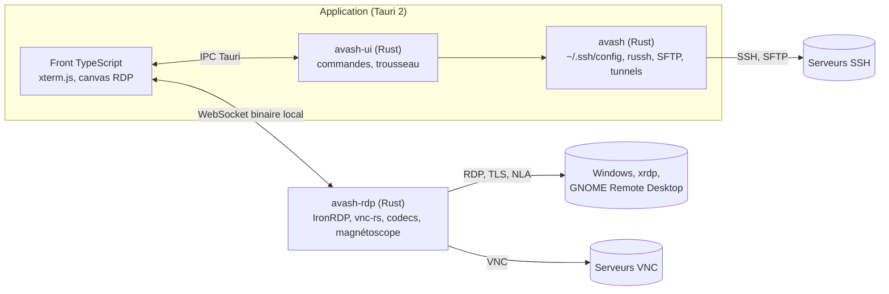

<div align="center">


# avash

**Gestionnaire de connexions SSH et RDP, natif, rapide, sécurisé.**

Vos terminaux SSH, vos bureaux Windows et vos transferts de fichiers dans une seule
application, qui lit votre `~/.ssh/config` tel quel.

[Français](README.md) · [English](README.en.md)

[](https://github.com/AdrienAvalon/avash/releases/latest)
[](https://github.com/AdrienAvalon/avash/releases)
[](#installation)
[](LICENSE)

[](https://github.com/AdrienAvalon/avash/actions/workflows/ci.yml)
[](https://github.com/AdrienAvalon/avash/actions/workflows/securite.yml)
[](https://scorecard.dev/viewer/?uri=github.com/AdrienAvalon/avash)
[](docs/qualite.md)


</div>

## En bref

| | |
|---|---|
| **SSH** | terminal complet (xterm.js), onglets, `ProxyJump` en chaîne, agent, clés générées et déployées depuis l'application |
| **RDP** | bureaux Windows, xrdp et GNOME Remote Desktop intégrés (IronRDP), redimensionnement natif sans zoom d'image, presse-papiers partagé sur demande, fichiers copiés-collés dans les deux sens |
| **VNC** | les bureaux VNC dans la même fenêtre (ZRLE, clavier en keysyms, presse-papiers), par le même processus que le RDP |
| **SFTP** | panneau de fichiers sur la session du terminal : parcourir, envoyer et télécharger fichiers ou dossiers entiers, reprendre un transfert coupé, file de transferts avec vitesse, copie d'un hôte à l'autre sans passer par le disque du poste |
| **Tunnels** | locaux (`-L`), distants (`-R`) et SOCKS (`-D`), avec leur état en direct |
| **Organisation** | dossiers par glisser-déposer, étiquettes, recherche instantanée, palette de commandes, snippets, santé des hôtes, enregistrement de session |
| **Import** | PuTTY (fichiers ou registre) et MobaXterm, bureaux RDP et dossiers compris |
| **Sécurité** | mots de passe dans le trousseau du système, clés d'hôte vérifiées en SSH **et** en RDP avant le moindre identifiant, aucune télémétrie |

<div align="center">

</div>

## Pourquoi avash

- **Rien à migrer.** avash lit `~/.ssh/config` et y écrit ce que vous ajoutez, au
  format d'OpenSSH : vos hôtes apparaissent au premier lancement, et `ssh` en
  ligne de commande continue de voir la même chose.
- **Natif.** Tauri 2 et Rust, pas d'Electron : une vingtaine de mégaoctets, un
  démarrage en une fraction de seconde, un bureau distant qui suit la fenêtre
  au pixel près.
- **Sûr par défaut.** Un serveur dont la clé change est refusé, en SSH comme en
  RDP, et un serveur RDP ne peut pas obtenir un mot de passe sans
  authentification mutuelle. Les secrets vivent dans le trousseau, jamais dans
  un fichier.
- **Libre.** AGPL-3.0, code auditable, binaires reproductibles avec attestation
  de provenance.

<div align="center">

</div>

## Installation

Les binaires sont sur la [page des versions](https://github.com/AdrienAvalon/avash/releases/latest),
signés pour la mise à jour automatique et accompagnés de leurs empreintes.

### Linux

```bash
chmod +x Avash_0.7.2_amd64.AppImage
./Avash_0.7.2_amd64.AppImage
```

L'AppImage embarque tout ce qu'il faut, WebKitGTK compris : rien à installer.

### Windows

- **Installeur** `Avash_x.y.z_x64-setup.exe`, installation classique.
- **Portable** `avash-x.y.z-windows-x64.zip`, à décompresser et lancer, sans
  installation ni écriture dans la base de registre. Garder `avash-rdp.exe` à
  côté d'`avash.exe`.

Windows affiche un avertissement au premier lancement : avash n'est pas signé
par un certificat Authenticode. « Informations complémentaires », puis
« Exécuter quand même ».

### macOS

`Avash_x.y.z_aarch64.dmg` pour les Mac à puce Apple. L'application n'est pas
notarisée : clic droit sur l'application, **Ouvrir**, une fois. La version
macOS est construite et testée en intégration continue mais n'a pas encore été
éprouvée sur une machine réelle : les retours sont bienvenus.

### Vérifier ce que vous avez téléchargé

```bash
sha256sum -c SHA256SUMS                                             # intégrité
gh attestation verify Avash_0.7.2_amd64.AppImage --repo AdrienAvalon/avash   # provenance
```

La seconde vérification prouve que le fichier vient de ce dépôt, de ce commit,
produit par notre chaîne d'intégration continue (attestation Sigstore).

### Depuis les sources

Rust stable, Node.js 22 et les dépendances système de Tauri suffisent ; les
étapes sont dans [CONTRIBUTING.md](CONTRIBUTING.md). `./scripts/release.sh`
enchaîne validation, construction et empreintes.

### Premier lancement, en trois gestes

1. Vos hôtes de `~/.ssh/config` sont déjà dans la barre latérale ; **double-clic**
   pour ouvrir un terminal, `Ctrl+B` pour le panneau de fichiers.
2. **Connexion directe** pour un serveur SSH ou un bureau RDP qui n'y est pas
   encore ; cochez « enregistrer » et il y reste, au format d'OpenSSH.
3. `Ctrl+K` pour tout le reste : hôtes, tunnels, snippets, langue, santé des
   hôtes, enregistrements. Le mot de passe, une seule fois : il va au trousseau.

## Au quotidien

<div align="center">

</div>

| Raccourci | Action |
|---|---|
| `Ctrl+K` | Palette de commandes : hôtes, actions, langue, santé, enregistrements |
| `Ctrl+W` · `Ctrl+Tab` · `Ctrl+1`…`9` | Fermer, suivant, aller à un onglet |
| `Ctrl+B` | Panneau de fichiers (SFTP) |
| `↑` `↓` `Entrée` `Maj+F10` | La barre latérale entière au clavier |

- Interface en **français** et en **anglais** : suit la locale, se change dans la
  palette, ou `AVASH_LANGUE=fr|en`.
- **Santé des hôtes** : une sonde TCP par hôte, à la demande ou au démarrage,
  voyant sur chaque ligne.
- **Enregistrement de session** au format asciicast v2, rejouable avec
  `asciinema play` ; la sortie, jamais les frappes.
- **Accessible** : navigation complète au clavier, contrastes vérifiés par
  `axe-core` sur les deux thèmes.

## Face aux autres outils

| | avash | PuTTY | MobaXterm | Remmina | Termius |
|---|:-:|:-:|:-:|:-:|:-:|
| SSH, RDP, VNC et SFTP dans la même fenêtre | ✓ | SSH | ✓ | ✓ | SSH, SFTP |
| Lit et écrit `~/.ssh/config` | ✓ | – | – | – | import |
| Linux, Windows, macOS | ✓ | Windows, Unix | Windows | Linux | ✓ |
| Natif, sans Electron | ✓ | ✓ | ✓ | ✓ | – |
| Clé d'hôte RDP vérifiée avant les identifiants | ✓ | – | – | ✓ | – |
| Mots de passe dans le trousseau du système | ✓ | – | chiffrés | ✓ | nuage |
| Libre | AGPL-3.0 | MIT | freemium | GPL-2.0 | abonnement |

D'après la documentation publique de chaque outil, septembre 2026. Corrigez-nous
par une issue si une case est fausse.

## Sécurité

- Mots de passe **uniquement dans le trousseau du système**, jamais en clair sur
  le disque ni transmis à l'interface : le cœur natif les lit au moment de
  connecter, et le mot de passe RDP part par l'entrée standard du processus RDP,
  invisible dans la liste des processus.
- Clés d'hôte SSH vérifiées (TOFU), connexion refusée si la clé change, **y
  compris quand seul l'algorithme diffère**. Même règle pour le serveur RDP,
  **avant** que CredSSP ne transmette le moindre identifiant ; le repli de NLA
  vers TLS seul est refusé.
- Presse-papiers partagé avec les bureaux distants seulement si vous le voulez,
  dans les deux sens, révocable à tout moment.
- Écritures atomiques de `~/.ssh/config`, `known_hosts` et des fichiers de
  configuration ; rien d'illimité ne vient du réseau (résolution, surfaces,
  images, sortie de commande, presse-papiers, tous plafonnés).
- Aucune télémétrie, aucun appel réseau autre que vos connexions.

Le modèle de sécurité, ce qu'il couvre et ce qu'il ne couvre pas, et comment
signaler une faille : [SECURITY.md](SECURITY.md).

## Qualité

**1139 tests** à chaque commit, sur deux chaînes indépendantes (GitHub Actions
sur Linux, Windows et macOS ; un miroir GitLab avec de vrais serveurs xrdp) :

| Niveau | Tests | En un mot |
|---|---:|---|
| Cœur Rust et intégration contre un vrai sshd | 194 | parseurs, import, SFTP, tunnels, rebonds |
| Interface Tauri | 64 | commandes, magasin de sessions, clavier |
| Processus RDP | 119 | négociation, canal graphique, session VNC, fichiers par le presse-papiers, rejeu d'enregistrements réels, fuzzing par mutation |
| Paquets IronRDP et vnc-rs portés | 595 | nos correctifs, un serveur VNC hostile, et les tests amont qui ne s'exécutaient nulle part |
| Front (Vitest) | 110 | logique pure, keysyms VNC, traductions |
| Bout en bout (WebdriverIO) | 57 | l'application réelle, connexions SSH, RDP et VNC effectives, audit `axe-core` |

Plus `clippy` strict en debug et en release, ESLint, stylelint, knip, `cargo
audit`, `cargo deny`, `npm audit`, CodeQL, gitleaks, le Scorecard de l'OpenSSF,
six cibles cargo-fuzz et un parc RDP en conteneurs. Une règle tient lieu de
discipline : **un nouveau test doit avoir été vu échouer.** Le détail, avec ce
que chaque dispositif a réellement trouvé : [docs/qualite.md](docs/qualite.md).

## Architecture

Trois composants : un cœur SSH réutilisable (`crates/avash`), l'application
Tauri (`crates/avash-ui`), et un processus de bureau distant séparé
(`rdp-sidecar` : IronRDP pour le RDP, vnc-rs pour le VNC) qui parle à
l'interface par WebSocket binaire local. Quatre paquets IronRDP et le client
VNC sont portés avec des correctifs ciblés, documentés dans
[rdp-sidecar/vendor/README.md](rdp-sidecar/vendor/README.md). Le reste est dans
[docs/architecture.md](docs/architecture.md).



## Contribuer

Les défauts et les propositions se déposent dans les
[issues](https://github.com/AdrienAvalon/avash/issues/new/choose), les questions
dans les [discussions](https://github.com/AdrienAvalon/avash/discussions). Avant
une PR : [CONTRIBUTING.md](CONTRIBUTING.md) (outillage, `./check.sh`, règles de
test) et [CODE_OF_CONDUCT.md](CODE_OF_CONDUCT.md). En français ou en anglais.

## Documentation

- [CHANGELOG.md](CHANGELOG.md), l'historique des versions
- [docs/feuille-de-route.md](docs/feuille-de-route.md), le cap et les priorités
- [docs/qualite.md](docs/qualite.md), les tests et ce qu'ils ont trouvé
- [docs/architecture.md](docs/architecture.md), l'architecture technique
- [SECURITY.md](SECURITY.md), le modèle de sécurité
- [tests-parc/README.md](tests-parc/README.md), le parc RDP local
- [RELEASE.md](RELEASE.md), construire et distribuer

## Licence

avash est distribué sous licence **[AGPL-3.0-or-later](LICENSE)** : libre de
l'utiliser, de l'étudier, de le modifier et de le redistribuer, à condition de
publier toute version modifiée sous la même licence, y compris mise à
disposition comme service en réseau. Une licence commerciale est disponible
pour l'intégrer dans un produit propriétaire : adrien.cros@outlook.com.

© 2026 Adrien Cros.

<div align="center">

[](https://star-history.com/#AdrienAvalon/avash&Date)

</div>
